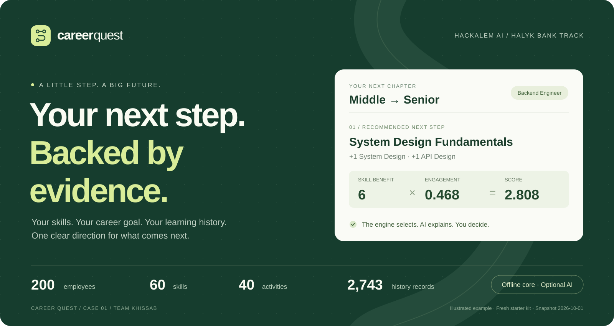
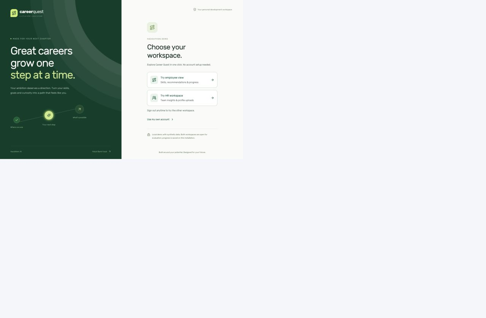
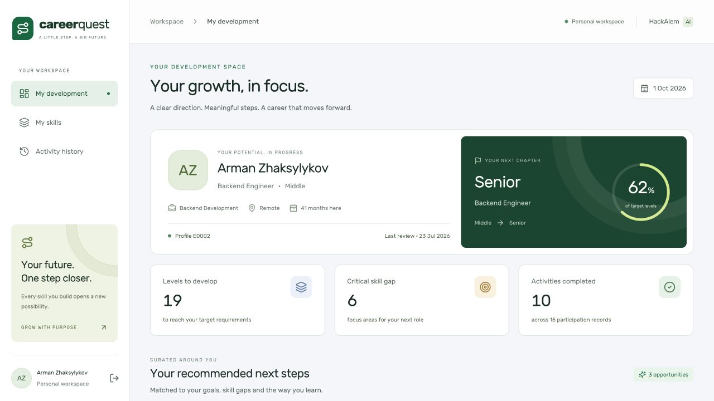
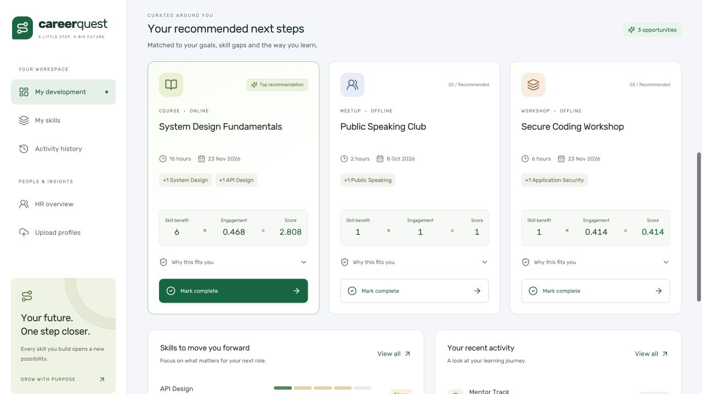
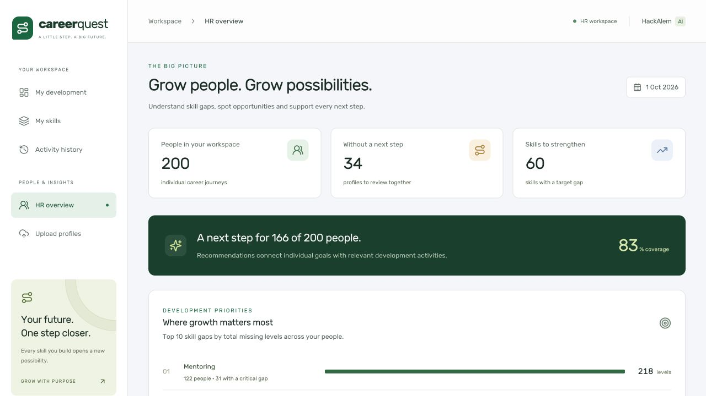
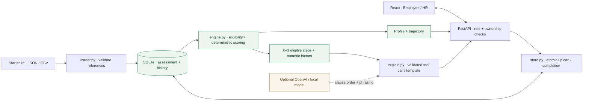

# Career Quest

### A clear next step. Backed by evidence.

**HackAlem AI · Halyk Bank track · Case 1 · Team Khissab**


**[Run locally](#start-with-one-command)** · **[Product preview](#preview)** · **[Jury demo](#main-demonstration)** · **[Verification](#verification)** · **[O‘zbekcha qo‘llanma](docs/GUIDE.uz.md)**



Career Quest turns an employee’s **skills, career goal and learning history** into 1–3 useful development steps. Each recommendation shows why it fits, what it improves and how its score was calculated. Completing a step updates the employee’s skills and career trajectory; HR sees where the team needs support.

**The deterministic engine selects. An optional language model explains. The employee chooses the next step.**

> Built for the local hackathon defense: synthetic data, local SQLite and a working no-key mode. The core needs no cloud service. Initial Docker builds need internet or cached dependencies; use the [prepared offline workflow](#prepare-for-an-offline-defense) for an offline machine.

## Preview

Real screens from a freshly seeded local app with template explanations. Click any image to inspect it at full size. The banner above is an illustration; the screens below are application captures.

| Choose a workspace | Employee development |
| :---: | :---: |
| [](assets/readme/screen-welcome.jpg) | [](assets/readme/screen-employee.jpg) |
| **Start in one click.** Explore the employee experience or HR workspace. | **Know where you stand.** Profile, target, skill gaps and progress together. |

| Recommendations with evidence | HR overview |
| :---: | :---: |
| [](assets/readme/screen-evidence.jpg) | [](assets/readme/screen-hr.jpg) |
| **Understand the next step.** Inspect the factors behind each recommendation. | **See who needs support.** Open profiles and upload additional jury data. |

## What it solves

A low skill score alone does not tell an employee what to learn next. The activity must help their target grade, be accessible with their current skills, and account for their participation history. Career Quest makes that decision traceable.

| For an employee | For HR and the jury |
|---|---|
| A personal trajectory toward the target role and grade | Team skill gaps, including promotion-critical gaps |
| Up to three eligible, useful next steps | Identifiable employees without a useful next step |
| Visible gaps, gains, weights and engagement evidence | Participation by activity and status |
| Completion that updates skills and persists after restart | JSON and CSV upload for additional evaluation profiles |

- **Promotion-aware recommendations:** critical skills weigh 3×; useful gains respect the event ceiling and remaining gap.
- **History-aware decisions:** skips reduce engagement, while self-initiated completions increase it within a cap.
- **Grounded explanations:** target, skill gaps and participation evidence always come from machine-readable factors.
- **Reliable progress:** assessment and learning history stay separate; atomic, idempotent completions avoid double-counting.
- **Two permission scopes:** employees access their own data; HR can review the team and upload profiles.
- **Offline operation:** local data, local fonts and a template fallback; OpenAI or a local model is optional.

## Reading map

| I want to… | Go to |
|---|---|
| Start the app from a fresh checkout | [One-command run](#start-with-one-command) |
| Present it in five minutes | [Main demonstration](#main-demonstration) · [O‘zbekcha himoya ssenariysi](docs/GUIDE.uz.md#5-daqiqalik-himoya-ssenariysi) |
| Understand how recommendations work | [Architecture](#architecture-and-stack) · [Scoring rules](#recommendation-rules) |
| Test a new or adversarial profile | [Trap upload](#upload-and-test-a-trap-profile) · [API](#api) |
| Configure access or an optional model | [Authentication](#jury-access-and-private-sign-in) · [Model configuration](#openai-and-local-explanations) |
| Verify the implementation | [Acceptance evidence](#verification) · [Detailed record](VERIFICATION.md) |
| Resolve a startup problem | [Troubleshooting](#troubleshooting) |

## Start with one command

### 1. Check prerequisites

| Requirement | Details |
|---|---|
| Docker | Docker Desktop, or Docker Engine with the Compose plugin; Docker must be running |
| Compose | **2.24+** for the optional local `.env` file syntax |
| Ports | `5173` for the app and `8000` for the backend; both bind to loopback |
| Dataset | The separately supplied Career Quest starter kit; it is intentionally excluded from Git |
| First build | Internet access or already cached base images and dependencies |

Docker handles Python and Node; **neither is required on the host** for this path. Commands below run from the repository root. On Windows, use Docker Desktop with WSL2; the offline `.sh` scripts run in WSL or another Bash environment.

```bash
docker info
docker compose version
```

### 2. Clone and place the dataset

```bash
git clone https://github.com/BAITC-Hacks/hack-26eeaf57-khissab.git
cd hack-26eeaf57-khissab
mkdir -p data
```

Extract the supplied starter kit and copy the **contents of `career_quest_dataset/`** into `data/`. The JSON and CSV files must be directly inside `data/`, not one folder deeper:

```text
data/                         # local only, gitignored
├── README.md                 # supplied schema documentation
├── employees.json
├── events.json
├── skills.json
└── activity_history.csv
```

If your kit is already at `case_1/career_quest_dataset/`, use `cp -R case_1/career_quest_dataset/. data/`. A fresh Git clone does not contain that ignored folder. The app validates references at startup; the expected starter-kit counts are listed [below](#dataset-and-skill-progress).

### 3. Start

```bash
docker compose up
```

Wait for both services to start, then open **[localhost:5173](http://localhost:5173)**. Choose **Try employee view** or **Try HR workspace**. The employee button opens E0002; HR opens the team overview with jury upload access. No `.env`, API key, account setup or second terminal is required.

| Address | Expected result |
|---|---|
| [localhost:5173](http://localhost:5173) | Career Quest workspace selection |
| [localhost:8000/health](http://localhost:8000/health) | `{"status":"ok"}` |
| [localhost:8000/openapi.json](http://localhost:8000/openapi.json) | API schema; data endpoints still require authentication |

Compose loads [.env.example](.env.example), then an optional existing `.env`. First startup creates SQLite and a private authentication key in `storage/`. Restarts retain uploads, completion progress, access codes and unexpired sessions. Frontend source and local fonts are mounted separately; container dependencies stay in the image.

### Day-to-day commands

| Action | Command |
|---|---|
| Start in the background and wait for health checks | `docker compose up -d --wait` |
| Check service health | `docker compose ps` |
| Inspect the last 100 log lines | `docker compose logs --tail=100 backend frontend` |
| Follow logs | `docker compose logs -f` |
| Stop services, keeping local progress | `docker compose stop` |
| Resume stopped services | `docker compose up -d --wait` |
| Rebuild after dependency or image configuration changes | `docker compose up --build -d --wait` |
| Apply backend `.env` changes | `docker compose up -d --force-recreate backend` |

`Ctrl+C` stops a foreground run. Keep `storage/` and its `.auth-key` together when backing up an installation. Do not delete that directory to troubleshoot a normal restart.

### Jury access and private sign-in

The supplied configuration enables `AUTH_DEMO_MODE=true` only with `APP_ENV=local`. **Anyone who can access this local app can enter the HR workspace**, upload synthetic profiles and change demo progress. This is intended for the local synthetic-data defense. Each button creates an ordinary eight-hour session: the employee session is restricted to E0002, and the HR session has HR permissions. Account keys and access codes are not exposed.

For private account-code sign-in, set `AUTH_DEMO_MODE=false` in your local `.env`, then apply it:

```bash
docker compose up -d --force-recreate backend
```

This hides the demo buttons and rejects both new demo sign-ins and previously issued demo sessions. Private account-code sessions retain their normal expiry. An `APP_ENV` other than `local` always disables demo access, even when the demo flag is true. The backend also defaults to demo access disabled when the flag is absent.

Use **Use my own account** for a private account; when demo mode is off, the account form is shown directly. The local operator obtains its access code:

```bash
docker compose exec backend python -m backend.auth credentials hr
docker compose exec backend python -m backend.auth credentials employee:E0002
```

Enter `E0002` (or `employee:E0002`) and the returned 10-character `access_code`, or use `hr` for HR. Previously issued long access codes remain valid. Share each employee code only with its owner. Any uploaded employee gets the same account format, for example `DEMO_TRAP` or `employee:DEMO_TRAP`. Codes are never embedded in the frontend or returned by a public endpoint. Keep `storage/*.auth-key` private and backed up with the database; it determines the installation’s login codes.

Employee sessions can read and complete only their own profile. HR can inspect profiles, upload jury data and open the HR view. Authorization is enforced by every data API, not only by hiding buttons. Anonymous access returns 401; unauthorized employee or HR access returns 403. Sessions expire after eight hours and are revoked on sign-out. Login attempts are rate-limited. Session tokens live in the browser’s session storage; API responses use `Cache-Control: no-store`.

### Prepare for an offline defense

While images can be built, run:

```bash
bash scripts/prepare-offline.sh
```

Keep the repository, `data/` and `offline/career-quest-images.tar` on the defense computer. The image bundle matches the build machine’s CPU architecture. Then one command loads the images and starts the app without building or pulling:

```bash
bash scripts/run-offline.sh
```

This mode explicitly disables both model providers, even if `.env` contains a key. It uses the same deterministic engine, grounded template explanations, authentication and SQLite. The bundle contains images only, not `.env`, private keys or the database. Do not publish the starter kit or private local files. After the normal images are loaded, `docker compose up` also works with empty model keys.

## Architecture and stack



The profile path is independent of model explanations: a pending or failed model request does not delay the profile. Only the engine selects and scores events. No vector database, RAG or embeddings are used.

| Layer | Technology | Responsibility |
|---|---|---|
| Interface | React 19, Vite 6, Tailwind CSS 3, Lucide | Employee and HR workspaces, numeric evidence, upload and completion |
| API | Python 3.12 in Docker, FastAPI, Pydantic | Validated contracts, access control and HTTP endpoints |
| Recommendation | Deterministic Python engine | Effective skills, hard filters, benefit, engagement and tie-breaking |
| Storage | SQLite | Local assessment/history, sessions, uploads and persistent progress |
| Explanation | HTTPX, optional OpenAI/local model, templates | Tool-call self-check and grounded fallback |
| Quality and delivery | pytest, Node test runner, Docker Compose | Regression checks, reproducible builds and offline packaging |

Node 22 is used in Docker. npm installs from the committed lockfile.

### Repository map

```text
backend/
  auth.py          Local access codes, sessions, role/ownership checks and CLI
  loader.py        Dataset parsing, validation and one-time seeding
  engine.py        Skill reconstruction, deterministic scoring and trajectory
  store.py         Transactions, uploads, completions and legacy migration
  explain.py       OpenAI/local tool call, validation and template fallback
  check_llm.py     Explicit live smoke test using fabricated facts only
  main.py          API routes and HR aggregates
  schemas.py       Upload and completion contracts
  uploads.py       JSON/multipart validation
  tests/           Engine, auth, migration, explanation, loader and API tests
frontend/
  src/main.jsx     Sign-in, sessions, navigation and request orchestration
  src/api.js       Bearer requests and session-aware expiry handling
  src/ui.jsx       Employee, HR, evidence and upload components
  src/loadEmployee.js   Independent profile and recommendation loading
  tests/           Session race and slow/failing recommendation regression checks
examples/          Fabricated jury trap profile and history
scripts/           Offline preparation and startup
assets/readme/     Local banner and real application screenshots
docs/GUIDE.uz.md   Uzbek startup and five-minute jury walkthrough
data/             Supplied starter kit (gitignored)
storage/          Local SQLite and authentication key (gitignored)
offline/          Prepared Docker images (gitignored)
```

### Design

The interface uses forest green (`#187653`), deep green (`#163D2E`), light surfaces and locally bundled **Rubik** typography. Lime accents mark the career target; compact evidence cards keep gaps, multipliers and scores visible. Employee development and HR actions have separate navigation. The UI has keyboard focus states, a skip link, labelled controls and independent recommendation loading/error states.

The showcase structure takes inspiration from [Hafiz](https://github.com/abbosoktambayev/hafiz-showcase). The banner and captures here are original Career Quest assets; no Hafiz screenshots or artwork are reused.

## Dataset and skill progress

The dataset has 200 employees, 40 activities, 60 skills, 32 role/grade profiles and 2,743 history records. `2026-10-01` is the snapshot clock. History spans the preceding 24 months. `data/README.md` is the schema authority and explicitly states that all people and data are synthetic.

`employee.skills` is the assessment at `last_review_date`. Effective skills are reconstructed from that baseline plus completed activities strictly after the assessment and on/before the snapshot. Apply events chronologically with:

```text
new_level = current + max(0, min(gain, max_level - current))
```

Missing skills start at zero. Skills already above an event’s ceiling never decrease. Non-completed and future records do not add skills. Application completions are known to occur after the assessment, including the same calendar day; their transaction order is retained. The API exposes the effective profile plus `assessed_skills` and a `skill_updates` ledger.

Completion appends history atomically without overwriting the assessment. Repeated reads, uploads and restarts therefore do not double-count learning. Backdated imports are replayed in chronological order. Existing databases from the previous version migrate once: recorded completion before-values restore the assessment baseline, then history supplies the progress. A completion `request_id` makes retries idempotent.

## Recommendation rules

1. Target the career-goal role/grade, otherwise the next grade in Junior → Middle → Senior → Lead. A Lead without a goal keeps Lead requirements.
2. Require the current role/grade to match the event’s audience and all prerequisites to be met by effective skills. Exclude mandatory and already-completed events; recurring club EV_036 may repeat but must still pass all other filters.
3. Calculate positive gaps against target requirements. Event benefit is limited by its gain, ceiling and remaining gap. Promotion-critical skills have weight 3, other required skills weight 1.
4. Weight benefit by the employee’s history of the activity’s type: declines, no-shows and drops lower engagement; self-initiated completions raise it.
5. Return at most three positive, eligible results. Ties use earliest availability, shorter duration, higher average feedback, then event ID. No eligible useful event returns an empty list.

```text
gap            = max(0, required - effective_current)
effective_gain = max(0, min(gain, max_level - effective_current, gap))
benefit        = sum(effective_gain × (3 if critical else 1))
decline_factor = 0.6 ^ skip_count
self_factor    = min(1.15 ^ self_completion_count, 1.3)
engagement     = clamp(decline_factor × self_factor, 0.2, 1.3)
score          = benefit × engagement
progress_pct   = 100 × (1 - total_gap / total_required_levels)
```

Normal `factors` carry target grade, skill gaps, effective gains, criticality, engagement counts/multipliers, benefit and score. `debug=true` additionally exposes detailed factors for the authorized profile. Historical engagement does not ban an activity; hard eligibility filters do.

Gateway evidence describes higher-ceiling activities that a critical-skill step can help unlock. It supplies no scoring bonus and bypasses no prerequisites or audience restrictions. An activity is called unlocked only when all its prerequisite blockers would be met.

## Main demonstration

1. Click **Try employee view** to enter E0002. The initial Middle Backend Engineer targets Senior. History contains Mentor Track completed after the last assessment, so Mentoring is **2**, and trajectory progress is **62%**.
2. EV_005 System Design Fundamentals ranks first: critical System Design and API Design each contribute 3, benefit is **6**, course engagement is **0.468**, score is **2.808**. Its explanation includes grade, gaps, history and score.
3. Mark EV_005 complete. System Design and API Design move **1 → 2**, trajectory becomes **66%**, the activity appears in history, and EV_006/EV_007 become eligible. Reload to verify persistence. Grades themselves are not automatically promoted.
4. Sign out and click **Try HR workspace**. HR overview opens with skill gaps, participation and an actionable list of employees without a step, with names, IDs, target, gaps, reason and an Open button. A satisfied target is distinguished from a gap without a suitable activity.
5. Upload the trap profile below. Inspect numeric factors and confirm that the lowest skill does not automatically win.

The example numbers assume a freshly seeded database. Existing completions change them.

## Upload and test a trap profile

Click **Try HR workspace** (or sign in with a private HR code). In **Upload profiles → Files**, choose `examples/trap_employees.json` and `examples/trap_activity_history.csv`, then **Upload and open**. Expect 1 employee and 3 history rows. JSON mode also accepts `{ "employees": [...], "activity_history": [...] }` with optional `meta`.

The independently fabricated DEMO_TRAP has Application Security 0 and three workshop skips. EV_011’s score falls to **0.216** and it is absent from the top three. EV_005 ranks first with **6** from two critical skills and neutral course engagement. The unit test separately reproduces the TZ’s Public Speaking versus System Design trap and removes history/critical weighting independently to prove both are required.

For API checks in local demo mode, obtain an HR session token without any access code:

```bash
CQ_TOKEN="$(curl --fail -sS http://localhost:8000/auth/demo/login \
  -H 'Content-Type: application/json' \
  --data '{"account":"hr"}' | python3 -c 'import json,sys; print(json.load(sys.stdin)["access_token"])')"
curl --fail -sS http://localhost:8000/upload \
  -H "Authorization: Bearer $CQ_TOKEN" \
  -F 'employees_file=@examples/trap_employees.json;type=application/json' \
  -F 'history_file=@examples/trap_activity_history.csv;type=text/csv'
curl --fail -sS 'http://localhost:8000/recommend/DEMO_TRAP?debug=true' \
  -H "Authorization: Bearer $CQ_TOKEN"
```

In private mode, the local operator can obtain the token using `CQ_TOKEN="$(docker compose exec -T backend python -m backend.auth token hr)"`, then run the same upload and recommendation requests. Tokens are temporary credentials; keep them out of source files.

Use either the UI or API example for those IDs; submitting both correctly returns duplicate-ID error 409. For a combined JSON batch use `-H 'Content-Type: application/json' --data-binary @jury_batch.json` instead of the file arguments. Multipart employee JSON uses the dataset wrapper with `employees[]`; history CSV uses the original column names. Either collection can be omitted, but the batch must not be empty. All references, including managers in the same upload, are validated. `meta.as_of_date`, when supplied, must match the snapshot.

Uploads are append-only, atomic, and limited to 2 MiB, 1,000 profiles and 10,000 history records per request. Invalid input rolls back the entire batch. History-only uploads update effective skills, engagement and completed-event eligibility immediately. Keep uploaded files uncommitted.

## API

| Route | Access and behavior |
|---|---|
| `GET /health` | Public health check |
| `GET /auth/demo` | Public demo availability and fixed employee ID; no credentials |
| `POST /auth/demo/login` | Local demo only: `{account: "employee" \| "hr"}` → ordinary session for E0002 or HR |
| `POST /auth/login` | `{username, access_code}` → session token, expiry and identity |
| `GET /auth/me` / `POST /auth/logout` | Current identity / revoke current session |
| `GET /employees` | Employee sees only self; HR sees all profile summaries |
| `GET /employees/{id}` | Own profile or HR: effective profile, trajectory, assessment, skill updates and scoped history |
| `GET /recommend/{id}?limit=3&debug=false` | Own profile or HR: 0–3 steps, numeric factors and grounded rationale |
| `POST /complete` | Own profile or HR: `{employee_id,event_id,request_id}` → updated skills, changes and trajectory |
| `POST /upload` | HR only: JSON or multipart dataset profiles/history |
| `GET /hr/overview` | HR only: lagging skills, identifiable employees without a step and activity participation |

All protected requests need `Authorization: Bearer <token>`. Unknown IDs return 404; invalid schemas/references 422; duplicate uploads, ineligible completions and conflicting request IDs 409; oversized uploads 413; unsupported media types 415. A busy database returns 503 with `Retry-After: 1`. EV_036 needs a new request ID for each intentional repeat session. The frontend preserves a request ID on an uncertain network retry.

HR aggregates include only the minimal identities needed for follow-up; no raw histories or engagement records are embedded in the overview. Employee-specific endpoints enforce ownership. OpenAPI is available at `/openapi.json`; optional Swagger `/docs` loads third-party assets and is not part of the offline app.

## OpenAI and local explanations

The app uses a strict `submit_explanation` function call. The model chooses clause order and a supported phrasing per fact. A local self-check requires all facts exactly once and rejects additional fields, free text, invented numbers, malformed output or missing evidence. Text and numbers are rendered from the engine’s factors. This follows [OpenAI function calling documentation](https://developers.openai.com/api/docs/guides/function-calling).

To enable OpenAI, copy `.env.example` to `.env` only if you do not already have one, then edit locally:

```dotenv
LLM_PROVIDER=openai
OPENAI_API_KEY=your-private-key
LLM_MODEL=gpt-4o-mini
LLM_TIMEOUT_SECONDS=8
```

Only the backend reads the key. The endpoint is pinned to `https://api.openai.com/v1`; redirects and arbitrary remote endpoints are disallowed. The request uses `store: false`. Send only the preselected activity, target grade, skill gaps and aggregate participation counts; no names, employee IDs, full profiles or raw history. The project owner has explicitly authorized sending these synthetic recommendation facts to OpenAI. Offline mode sends nothing.

For a local tool-capable OpenAI-compatible server:

```dotenv
LLM_PROVIDER=local
LLM_BASE_URL=http://host.docker.internal:11434/v1
LLM_API_KEY=local
LLM_MODEL=your-loaded-model
```

Only loopback and `host.docker.internal` are accepted for the local provider. OpenAI keys are not reused for local servers. `LLM_PROVIDER=template` explicitly disables all model calls. Missing keys, network/provider errors, invalid output and timeouts fall back to the same grounded template. Up to three explanations run concurrently with a total model deadline of at most eight seconds and no automatic retries.

Apply environment changes with `docker compose up -d`. Verify actual model use using fabricated facts, without reading the employee dataset:

```bash
docker compose exec backend python -m backend.check_llm
```

The check must return `source: "llm"`, `fallback_reason: null`, validated facts and elapsed time below ten seconds. It exits nonzero on fallback; HTTP 200 alone is not evidence of model success. This explicitly makes up to three paid provider calls. Local equivalent: `.venv/bin/python -m backend.check_llm --env-file .env`.

## Verification

Latest pre-push recheck, **2026-09-23**: **116 backend tests passed**, **5 frontend tests passed**, Vite production build passed, and the starter-kit loader reported **0 reference errors** during the documentation check. Screenshots were captured from a separate fresh database with model calls disabled. The detailed [verification record](VERIFICATION.md) separates these rechecks from Docker, offline and live-model measurements.

The supplied dataset must be present for full coverage. Tests use isolated temporary databases. They do not reset or complete activities in the demo database.

```bash
.venv/bin/python -m pytest backend/tests -q
npm --prefix frontend test
npm --prefix frontend run build
.venv/bin/python -m backend.loader --data-dir ./data --database-url sqlite:///:memory:
```

Loader counts must be 200 employees, 40 events, 60 skills, 32 role profiles and 2,743 history records, with zero reference errors. Without host Python, run the same tests in Docker:

```bash
docker compose run --rm --no-deps -v "$PWD/examples:/app/examples:ro" \
  backend python -m pytest backend/tests -q
docker compose run --rm --no-deps frontend npm test
docker compose run --rm --no-deps frontend npm run build
docker compose run --rm --no-deps backend python -m backend.loader \
  --data-dir /app/data --database-url sqlite:///:memory:
```

Acceptance checks matching the TZ and AGENTS.md §7:

| Requirement | Evidence |
|---|---|
| Profile, trajectory, skills, completed history | API tests + Employee browser scenario |
| 1–3 relevant steps, hard filters and critical weighting | Engine tests over fabricated traps and every starter-kit employee |
| ≥3 explanation factors; no invented numbers | Strict tool-call and fallback tests |
| Jury profiles and history upload | JSON/multipart, atomic rollback, duplicate and restart tests |
| Correct historical and live progress | Post-review, capped/repeat gains, same-day completion, backdated upload and legacy migration tests |
| HR sees who has no step and activity participation | HR list assertions + browser navigation |
| Privacy and Employee/HR access | Anonymous, cross-employee, role escalation, expiry, revocation and login-limit tests |
| UI/profile independent of slow AI | Frontend deferred-request/error tests + separate backend request timing |
| Recommendation under 10s | Concurrent timeout test + explicit live provider smoke check |
| Offline, one-command run | Prepared images, forced-template overlay and offline startup script |

See [VERIFICATION.md](VERIFICATION.md) for measured results. Review the [engine tests](backend/tests/test_engine.py), [API and upload tests](backend/tests/test_api.py), [ownership and progress tests](backend/tests/test_access_and_progress.py), [demo authentication tests](backend/tests/test_auth_demo.py), [explanation tests](backend/tests/test_explain.py), [loader tests](backend/tests/test_loader.py) and [frontend loading tests](frontend/tests/loadEmployee.test.js). Browser timing and live model latency depend on the machine/provider; measured results are evidence, not a promise about every environment.

## Local development without Docker

Python 3.11+ and Node 22 are supported. Install dependencies while online or from cache:

```bash
python3 -m venv .venv
.venv/bin/python -m pip install -r backend/requirements.txt
npm --prefix frontend ci
```

Run these in separate terminals from the repo root:

```bash
APP_ENV=local AUTH_DEMO_MODE=true \
  DATA_DIR=./data DATABASE_URL=sqlite:///./storage/career_quest.sqlite3 \
  .venv/bin/python -m uvicorn backend.main:app --env-file .env --host 127.0.0.1 --port 8000
```

```bash
VITE_API_URL=/api VITE_API_PROXY_TARGET=http://127.0.0.1:8000 \
  npm --prefix frontend run dev -- --host 127.0.0.1
```

Omit `--env-file .env` if no file exists. The explicit environment variables enable the same one-click jury access as Docker. For private mode, change `AUTH_DEMO_MODE` to `false` and use `.venv/bin/python -m backend.auth credentials hr` to obtain the local login code. Data, storage, `.env`, private keys and offline image bundles are gitignored. The app is designed for a local synthetic-data defense; a deployment beyond loopback requires demo access disabled, HTTPS, an organizational identity system and an operational access-code distribution/revocation policy.

## Troubleshooting

Start with `docker compose ps` and `docker compose logs --tail=100 backend frontend`. Keep local credentials out of shared logs.

| Symptom | What to check or do |
|---|---|
| Cannot connect to the Docker daemon | Start Docker Desktop or your Docker Engine service; retry `docker info`. |
| Compose rejects `env_file` / `required` | Use Compose 2.24+ and the `docker compose` command. |
| Backend fails while loading data | Check the four exact filenames directly under `data/`. Read the validation errors; use the supplied schema in `data/README.md`. |
| Port 5173 or 8000 is already allocated | Stop the conflicting local application, or stop the previous Career Quest run, then start again. |
| First build fails without internet | Build and export on a connected machine of the same CPU architecture, then use [offline startup](#prepare-for-an-offline-defense). |
| Offline script cannot find images | Keep `offline/career-quest-images.tar` with the repository, or load the prepared image bundle first. |
| Page opens but data does not load | Check `/health`, backend logs and the backend container health. In local development, point `VITE_API_PROXY_TARGET` at `http://127.0.0.1:8000`. |
| Demo buttons are absent | Check `APP_ENV=local` and `AUTH_DEMO_MODE=true`; `.env` overrides `.env.example`. Recreate the backend after an intentional change. Private mode uses account codes instead. |
| A request returns 401 or the session expires | Sign in again. Session lifetime is eight hours; logout revokes the current token. |
| Upload/overview returns 403 | Use an HR session. Employee sessions are restricted to their own profile. |
| Upload returns 409 | An employee or history ID already exists. Do not re-upload the same fixture; use distinct IDs for a new batch. |
| Upload returns 422 or 413 | Correct the schema/references or reduce the batch below 2 MiB, 1,000 employees and 10,000 history rows. Invalid batches do not partially import. |
| Recommendations are empty | This can be correct: the target is met or no eligible activity closes a gap. HR shows the reason. |
| Explanation source is `template` | Expected with no key, forced offline mode or provider/validation failure. Inspect `fallback_reason`; the recommendation remains valid. |
| Demo numbers differ from this README | The examples assume a fresh starter kit. Existing completions and uploads persist across restarts. |
| Frontend dependencies appear stale | Rebuild with `docker compose up --build -d --wait`. Dependencies belong to the image, not host `node_modules`. |

## Scope and data handling

This is a working local hackathon solution, evaluated against [AGENTS.md](AGENTS.md). Screenshots use synthetic starter-kit data. Supplied raw data, private environment values, authentication keys, image bundles and local progress are excluded from version control.

Career progress is **coverage of target skill requirements**, not an automatic grade change or a promotion probability. The app supports development planning; completion does not award a new job grade. Public rankings, rewards, calendar integrations and full interface localization are outside the current scope. The `preferred_language` dataset field is retained; the current interface is English.

The official jury's extra profiles and final scoring are not available here. The reproducible checks above document the implemented requirements without claiming a guaranteed score.
